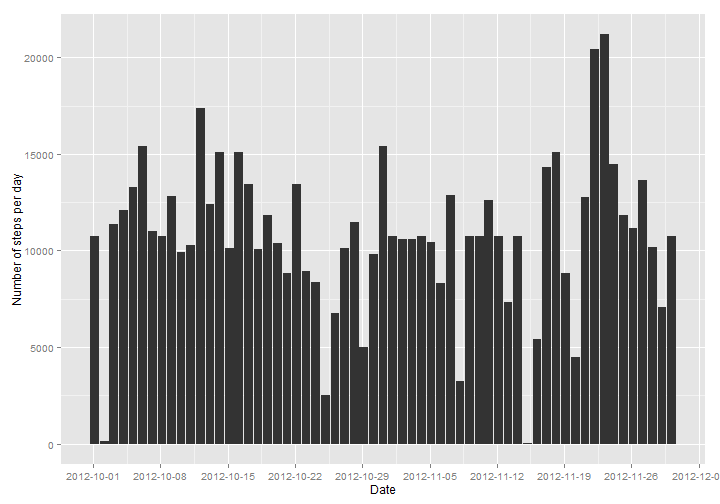

Analysis of Human Activity Pattern
========================================================
#### Andrey Alferov
#### Sunday, March 15, 2015

### Load required libraries

```r
library(dplyr)
library(ggplot2)
library(scales)
```

### Download dataset file, unzip it and load in dataframe

```r
if(!file.exists("./data"))
{dir.create("./data")}

url <- "http://d396qusza40orc.cloudfront.net/repdata%2Fdata%2Factivity.zip"
fileName <- "repdata_Fdata_Factivity.zip"

download.file(url, destfile = fileName)

unzip(fileName, exdir="data")

df <- read.csv(file="./data/activity.csv",head=TRUE,sep=",")
df$date <- as.Date(df$date)

summary(df)
```

```
##      steps             date               interval     
##  Min.   :  0.00   Min.   :2012-10-01   Min.   :   0.0  
##  1st Qu.:  0.00   1st Qu.:2012-10-16   1st Qu.: 588.8  
##  Median :  0.00   Median :2012-10-31   Median :1177.5  
##  Mean   : 37.38   Mean   :2012-10-31   Mean   :1177.5  
##  3rd Qu.: 12.00   3rd Qu.:2012-11-15   3rd Qu.:1766.2  
##  Max.   :806.00   Max.   :2012-11-30   Max.   :2355.0  
##  NA's   :2304
```


## Analize what is mean total number of steps taken per day
### Calculate the total number of steps taken per day

```r
daily <- group_by(na.omit(df), date)
per_day <- summarise(daily, steps = sum(steps))
summary(per_day)
```

```
##       date                steps      
##  Min.   :2012-10-02   Min.   :   41  
##  1st Qu.:2012-10-16   1st Qu.: 8841  
##  Median :2012-10-29   Median :10765  
##  Mean   :2012-10-30   Mean   :10766  
##  3rd Qu.:2012-11-16   3rd Qu.:13294  
##  Max.   :2012-11-29   Max.   :21194
```
### Make a histogram of the total number of steps taken each day

```r
plot <- qplot(as.POSIXct(date), steps, data=per_day, geom="histogram", stat="identity")
plot + xlab("Date") + ylab("Number of steps per day") + scale_x_datetime(breaks = date_breaks("1 week"))
```

 

### Calculate and report the mean and median of the total number of steps taken per day

```r
summarise(per_day, mean = mean(steps), median = median(steps))
```

```
## Source: local data frame [1 x 2]
## 
##       mean median
## 1 10766.19  10765
```

## Analize what is the average daily activity pattern
### Calculate the average number of steps taken per 5-minute interval across all days

```r
by_interval <- group_by(na.omit(df), interval)
per_interval <- summarise(by_interval, steps = mean(steps))
summary(per_interval)
```

```
##     interval          steps        
##  Min.   :   0.0   Min.   :  0.000  
##  1st Qu.: 588.8   1st Qu.:  2.486  
##  Median :1177.5   Median : 34.113  
##  Mean   :1177.5   Mean   : 37.383  
##  3rd Qu.:1766.2   3rd Qu.: 52.835  
##  Max.   :2355.0   Max.   :206.170
```

### Make a time series plot of the 5-minute interval (x-axis) and the average number of steps taken, averaged across all days (y-axis)

```r
ggplot(per_interval, aes(interval, steps)) + geom_line() + xlab("Time interval") + ylab("Mean number of steps") +
       scale_x_discrete(breaks = c(0,600,1200,1800,2400), labels = c("0:00","6:00","12:00","18:00","24:00"))
```

 

### Which 5-minute interval, on average across all the days in the dataset, contains the maximum number of steps?

```r
max_steps <- summarise(per_interval, max_steps = max(steps))
filter(per_interval, steps == as.numeric(max_steps))
```

```
## Source: local data frame [1 x 2]
## 
##   interval    steps
## 1      835 206.1698
```
The maximum number of steps occurs in the 5-minutes interval of the day starting at 8:35.

## Imputing missing values
### Calculate and report the total number of missing values in the dataset

```r
sum(is.na(df$steps)) 
```

```
## [1] 2304
```

### Create a new dataset that is equal to the original dataset but with the missing data filled in
### Missing values are replaced by mean values of steps for the particular time interval

```r
df_new <- df

for (i in 1:nrow(df_new)){
  if (is.na(df_new$steps[i])){
    df_new$steps[i] <- per_interval$steps[which(df_new$interval[i] == per_interval$interval)]}
}

df_new <- arrange(df_new, interval)
summary(df_new)
```

```
##      steps             date               interval     
##  Min.   :  0.00   Min.   :2012-10-01   Min.   :   0.0  
##  1st Qu.:  0.00   1st Qu.:2012-10-16   1st Qu.: 588.8  
##  Median :  0.00   Median :2012-10-31   Median :1177.5  
##  Mean   : 37.38   Mean   :2012-10-31   Mean   :1177.5  
##  3rd Qu.: 27.00   3rd Qu.:2012-11-15   3rd Qu.:1766.2  
##  Max.   :806.00   Max.   :2012-11-30   Max.   :2355.0
```

### Make a histogram of the total number of steps taken each day and Calculate and report the mean and median total number of steps taken per day

```r
daily_new <- group_by(df_new, date)
per_day_new <- summarise(daily_new, steps = sum(steps))
plot <- qplot(as.POSIXct(date), steps, data=per_day_new, geom="histogram", stat="identity")
plot + xlab("Date") + ylab("Number of steps per day") + scale_x_datetime(breaks = date_breaks("1 week"))
```

 
### Calculate and report the mean and median of the total number of steps taken per day

```r
summarise(per_day_new, mean = mean(steps), median = median(steps))
```

```
## Source: local data frame [1 x 2]
## 
##       mean   median
## 1 10766.19 10766.19
```
The median value of the total number of steps taken per day have slightely increased compared to the original data set and became the same as the mean value.

### What is the impact of imputing missing data on the estimates of the total daily number of steps?

```r
difference <- sum(df_new$steps) - sum(na.omit(df)$steps)
round(difference)
```

```
## [1] 86130
```
Due to imputation the total sum of steps increased by 86130 steps.

## Analize if there are differences in activity patterns between weekdays and weekends

```r
Sys.setlocale("LC_TIME", "English")
```

```
## [1] "English_United States.1252"
```

### Create a new factor variable in the dataset with two levels – “weekday” and “weekend” indicating whether a given date is a weekday or weekend day

```r
df_new$weekday <- factor(weekdays(df_new$date) %in% c("Saturday","Sunday"), 
                                  labels=c("weekday","weekend"), ordered=FALSE)
```

### Calculate the average number of steps taken per 5-minute interval across all days

```r
by_interval <- group_by(df_new, interval, weekday)
per_interval <- summarise(by_interval, steps = mean(steps))
summary(per_interval)
```

```
##     interval         weekday        steps        
##  Min.   :   0.0   weekday:288   Min.   :  0.000  
##  1st Qu.: 588.8   weekend:288   1st Qu.:  2.047  
##  Median :1177.5                 Median : 28.133  
##  Mean   :1177.5                 Mean   : 38.988  
##  3rd Qu.:1766.2                 3rd Qu.: 61.263  
##  Max.   :2355.0                 Max.   :230.378
```

### Make a time series plot

```r
ggplot(per_interval, aes(interval, steps)) + geom_line() + facet_grid(weekday ~ .) + 
  xlab("Time interval") + ylab("Mean number of steps") +
  scale_x_discrete(breaks = c(0,600,1200,1800,2400), labels = c("0:00","6:00","12:00","18:00","24:00"))
```

 


